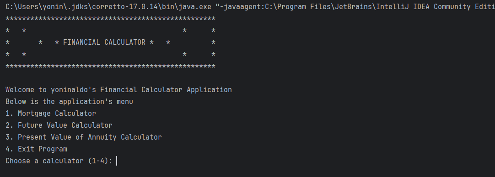
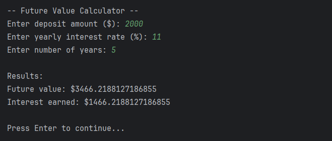
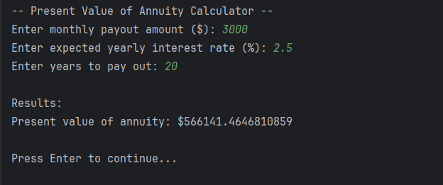
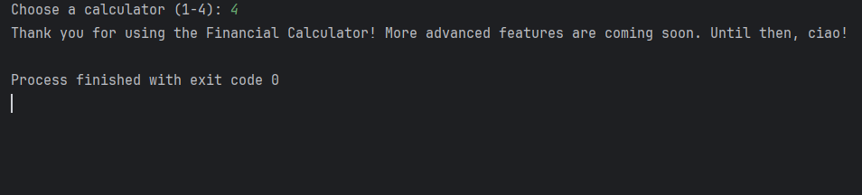

**Financial Calculator**
A Java-based command-line financial calculator that provides various financial calculations with a user-friendly menu interface.
**Features**
The Financial Calculator offers the following calculation tools:

**Mortgage Calculator**
   * Calculates monthly mortgage payments and total interest
   * Takes loan amount, interest rate, and loan duration as inputs

**Future Value Calculator**

   * Calculates the future value of investments using daily compounding
   * Takes deposit amount, interest rate, and investment period as inputs

**Present Value of Annuity Calculator**

   * Determines the present value of future periodic payments
   * Takes monthly payout amount, interest rate, and payment period as inputs
Example
Welcome to Financial Calculator
1. Mortgage Calculator
2. Future Value Calculator
3. Present Value of Annuity Calculator
4. Exit Program
Choose a calculator (1-4): 1

-- Mortgage Calculator --
Enter loan amount ($): 250000
Enter yearly interest rate (%): 3.5
Enter loan length (years): 30

Results:
Monthly payment: $1122.61
Total interest: $154139.29

**Technical Details**
* Uses Java's Math library for financial calculations
* Implements standard financial formulas:
   * Mortgage: M = P × (i*(1+i)^n / ((1+i)^n)-1)
   * Future Value: FV = P × (1 + (r / 365))^(365 × t)
   * Present Value of Annuity: PV = PMT × [(1 - (1 + r)^(-n)) / r]

**Screenshots**
* Display Menu

* Mortgage Calculator

* Future Value Calculator

* Present Value of Annuity Calculator

* Exit Program

**Interesting Code**
Daily Compounding in Future Value Calculation
double futureValue = deposit *
Math.pow(1 + (rateDecimal / 365), 365 * depositYears);